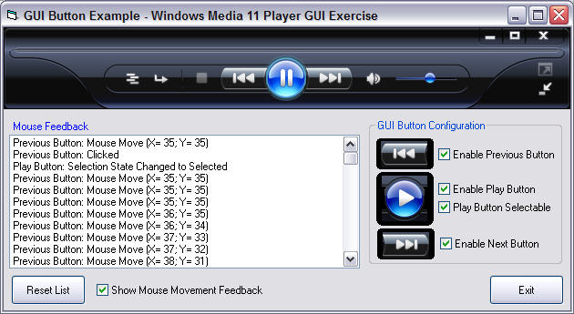

<div align="center">

## GUI Button Rollover


</div>

### Description

Provides the ability to emulate complex GUI designs with realitive ease. The button supports Normal, Mouse Over, Mouse Down, Disabled, Selected and Selected Over. 100% self-contained in a single UserControl file. Full visibility during design time, including full transparency when using a Mask image. Perfect for those complex GUI designs.
 
### More Info
 
Provide it the images for Normal, Mouse Over, Mouse Down, Disabled, Selected and Selected Over. You may or may not need to provide a Mask image, if any of your buttons overlap.

You must provide at least the Normal images and a Mask image. If the button does not overlap another button, then you must set the Mask image to the same image as Normal.

A beautiful GUI!


<span>             |<span>
---                |---
**Submitted On**   |2006-07-18 22:48:06
**By**             |[Master\_Coder](https://github.com/Planet-Source-Code/PSCIndex/blob/master/ByAuthor/master-coder.md)
**Level**          |Intermediate
**User Rating**    |4.8 (58 globes from 12 users)
**Compatibility**  |VB 5\.0, VB 6\.0
**Category**       |[Custom Controls/ Forms/  Menus](https://github.com/Planet-Source-Code/PSCIndex/blob/master/ByCategory/custom-controls-forms-menus__1-4.md)
**World**          |[Visual Basic](https://github.com/Planet-Source-Code/PSCIndex/blob/master/ByWorld/visual-basic.md)
**Archive File**   |[GUI\_Button2007507192006\.zip](https://github.com/Planet-Source-Code/master-coder-gui-button-rollover__1-66018/archive/master.zip)

### API Declarations

```
Only 3 of them and they are designed to aid in the detection Mouse Enter and Mouse Leave functionality.
Private Declare Function GetCapture Lib "User32" () As Long
Private Declare Function ReleaseCapture Lib "User32" () As Long
Private Declare Function SetCapture Lib "User32" (ByVal hWnd As Long) As Long
```


